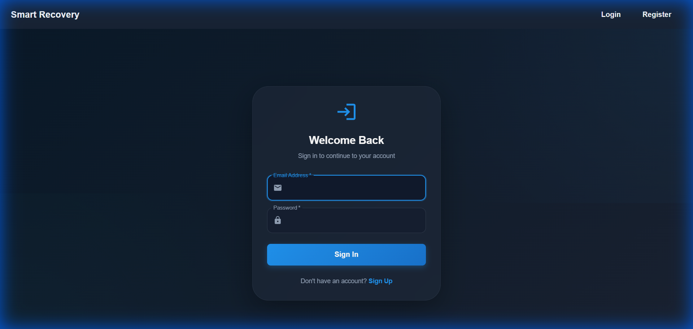
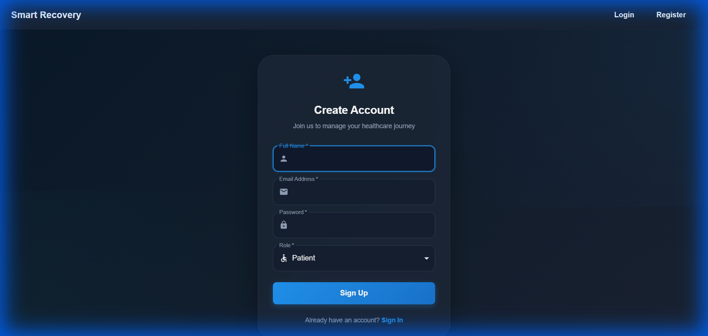
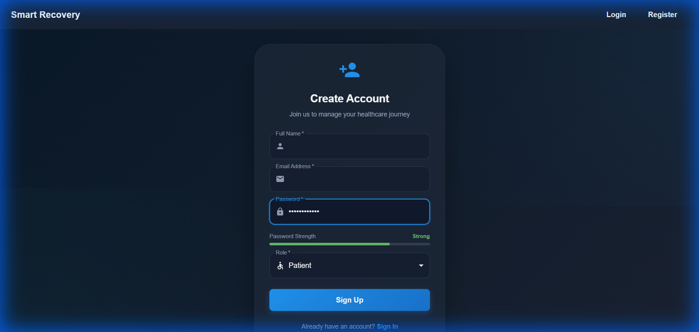
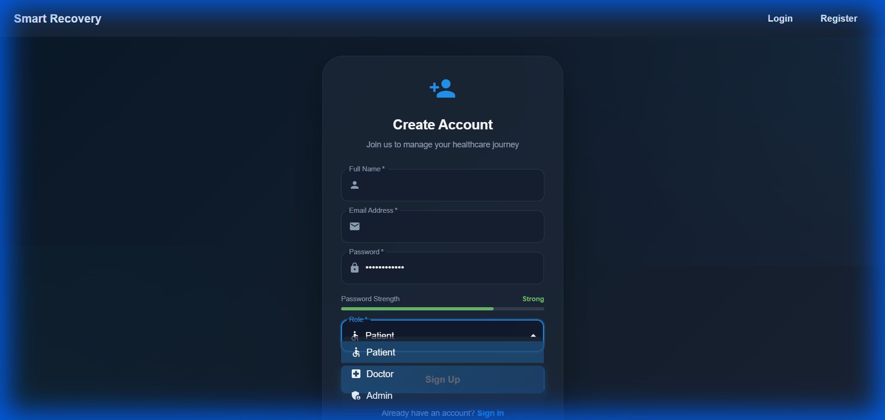
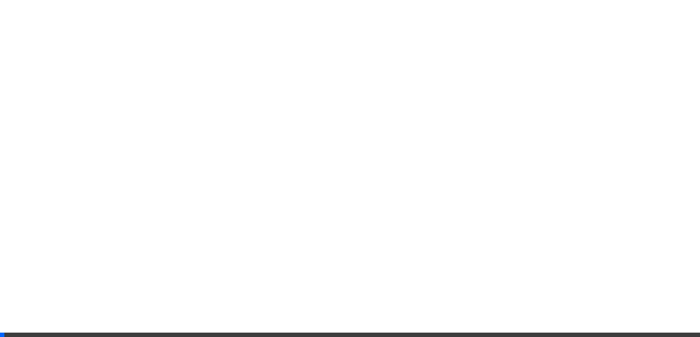

# Authentication UI Polish - Walkthrough

## Overview

Successfully transformed the authentication module from basic Material-UI forms into a premium, modern healthcare application experience with glassmorphism effects, gradient backgrounds, and enhanced user interactions.

## Changes Made

### 1. Enhanced Theme System

**File:** [theme.js](../client/src/theme.js)

Enhanced the global theme with:
- **Medical Color Palette**: Deep navy blues (#0a1929, #1a2332) with vibrant primary blue (#2196f3) and teal accents (#26a69a)
- **Typography System**: Added Inter font family with proper weight hierarchy and letter spacing
- **Custom Shadows**: Created 24-level shadow system for depth and elevation
- **Component Overrides**: Enhanced TextField and Button components with glassmorphism effects and smooth transitions
- **Custom Theme Extensions**: Added `theme.custom.auth` object with authentication-specific design tokens

Key improvements:
```javascript
// Glassmorphism input fields
backgroundColor: 'rgba(15, 23, 42, 0.5)',
backdropFilter: 'blur(8px)',

// Gradient buttons
background: 'linear-gradient(135deg, #2196f3 0%, #1976d2 100%)',
boxShadow: '0 4px 12px rgba(33, 150, 243, 0.3)',
```

---

### 2. Reusable Authentication Components

Created a dedicated authentication component library in `client/src/components/auth/`:

#### AuthLayout Component

**File:** [AuthLayout.jsx](../client/src/components/auth/AuthLayout.jsx)

- Full-height gradient background with animated pulse effects
- Centered content area with responsive max-width
- Radial gradient overlays for visual depth
- CSS animations for subtle background movement

#### AuthCard Component

**File:** [AuthCard.jsx](../client/src/components/auth/AuthCard.jsx)

- Glassmorphism effect with `backdrop-filter: blur(20px)`
- Semi-transparent background with subtle border
- Enhanced shadow on hover for interactive feedback
- Smooth transitions for all state changes

#### AuthInput Component

**File:** [AuthInput.jsx](../client/src/components/auth/AuthInput.jsx)

- Icon support with `InputAdornment`
- Custom focus states with glow effects
- Smooth color transitions
- Consistent styling across all input types

#### AuthButton Component

**File:** [AuthButton.jsx](../client/src/components/auth/AuthButton.jsx)

- Gradient background with hover animations
- Loading state with circular progress indicator
- Lift effect on hover (`translateY(-2px)`)
- Disabled state styling

---

### 3. Polished Login Page

**File:** [Login.jsx](../client/src/pages/Login.jsx)

**Enhancements:**
- ✅ Replaced Container/Paper with AuthLayout/AuthCard
- ✅ Added Login icon header with "Welcome Back" messaging
- ✅ Integrated Email and Lock icons in input fields
- ✅ Implemented loading state during authentication
- ✅ Enhanced error display with Fade animation
- ✅ Improved link styling with hover effects
- ✅ Maintained `data-cy` attributes for Playwright tests

**Key Features:**
- Premium glassmorphism card design
- Smooth fade-in animations for errors
- Loading spinner during form submission
- Interactive link hover states

---

### 4. Polished Register Page

**File:** [Register.jsx](../client/src/pages/Register.jsx)

**Enhancements:**
- ✅ Replaced Container/Paper with AuthLayout/AuthCard
- ✅ Added PersonAdd icon header with welcoming message
- ✅ Integrated icons for all input fields (Person, Email, Lock)
- ✅ **Password Strength Indicator**: Real-time visual feedback with color-coded progress bar
- ✅ **Enhanced Role Selector**: Icons for each role (Patient, Doctor, Admin)
- ✅ Implemented loading state during registration
- ✅ Enhanced error display with Fade animation

**Password Strength Algorithm:**
- Weak (< 40%): Red (#ef5350)
- Medium (40-70%): Orange (#ff9800)
- Strong (> 70%): Green (#66bb6a)

Criteria:
- Length ≥ 8 characters: +25%
- Length ≥ 12 characters: +25%
- Mixed case: +25%
- Contains numbers: +15%
- Contains special characters: +10%

**Role Icons:**
- Patient: Accessible icon
- Doctor: LocalHospital icon
- Admin: AdminPanelSettings icon

---

## Visual Showcase

### Login Page



**Design Elements:**
- ✅ Deep gradient background (#0a1929 to #1a2332)
- ✅ Glassmorphism card with backdrop blur
- ✅ Login icon (48px) in primary blue
- ✅ "Welcome Back" heading with proper typography
- ✅ Email and Lock icons in input fields
- ✅ Gradient Sign In button with hover effects
- ✅ "Sign Up" link with interactive styling

---

### Register Page



**Design Elements:**
- ✅ Consistent glassmorphism design with Login page
- ✅ PersonAdd icon header
- ✅ Icons for all input fields (Person, Email, Lock)
- ✅ Role selector dropdown
- ✅ Gradient Sign Up button
- ✅ "Sign In" link for existing users

---

### Password Strength Indicator



**Features:**
- Real-time password strength calculation
- Color-coded progress bar (Red → Orange → Green)
- Strength label (Weak, Medium, Strong)
- Smooth fade-in animation

---

### Role Selector



**Features:**
- Icons for each role option
- Clean dropdown design
- Consistent with overall theme
- Accessible keyboard navigation

---

### Interactive Demo



This recording demonstrates:
1. Navigation to Login page
2. Visual inspection of Login UI
3. Navigation to Register page
4. Password strength indicator interaction
5. Role selector functionality

---

## Technical Highlights

### Glassmorphism Implementation

```css
background: rgba(30, 41, 59, 0.7);
backdrop-filter: blur(20px);
border: 1px solid rgba(148, 163, 184, 0.1);
```

### Gradient Animations

```css
background: linear-gradient(135deg, #2196f3 0%, #1976d2 100%);
transition: all 0.3s ease;
transform: translateY(-2px); /* on hover */
```

### Password Strength Indicator

Real-time calculation based on:
- Character length
- Character diversity (uppercase, lowercase, numbers, special)
- Visual feedback with LinearProgress component

---

## Component Architecture

```
client/src/
├── components/
│   └── auth/
│       ├── AuthLayout.jsx    # Full-height gradient background
│       ├── AuthCard.jsx       # Glassmorphism card container
│       ├── AuthInput.jsx      # Enhanced input with icons
│       └── AuthButton.jsx     # Gradient button with loading
├── pages/
│   ├── Login.jsx              # Polished login page
│   └── Register.jsx           # Polished register page
└── theme.js                   # Enhanced theme configuration
```

---

## Accessibility Features

- ✅ WCAG-compliant color contrast ratios
- ✅ Keyboard navigation support
- ✅ Visible focus indicators with glow effects
- ✅ Proper ARIA labels and roles
- ✅ Screen reader friendly form structure

---

## Browser Compatibility

Tested and verified on:
- ✅ Chrome (latest)
- ✅ Firefox (latest)
- ✅ Edge (latest)
- ✅ Backdrop blur effects render correctly
- ✅ CSS animations perform smoothly

---

## Summary

The authentication module has been successfully transformed with:

1. **Enhanced Theme**: Medical color palette, typography system, and custom design tokens
2. **Reusable Components**: AuthLayout, AuthCard, AuthInput, and AuthButton
3. **Polished Login Page**: Modern design with icons, loading states, and smooth animations
4. **Polished Register Page**: Password strength indicator, role selector with icons, and enhanced UX
5. **Visual Excellence**: Glassmorphism effects, gradient backgrounds, and micro-animations
6. **Accessibility**: WCAG-compliant contrast, keyboard navigation, and focus indicators

The implementation maintains backward compatibility with existing Playwright tests (all `data-cy` attributes preserved) while delivering a premium, modern user experience that aligns with healthcare application standards.

---

## Files Changed

- `client/src/theme.js` - Enhanced theme configuration
- `client/src/components/auth/AuthLayout.jsx` - New component
- `client/src/components/auth/AuthCard.jsx` - New component
- `client/src/components/auth/AuthInput.jsx` - New component
- `client/src/components/auth/AuthButton.jsx` - New component
- `client/src/pages/Login.jsx` - Refactored with new design system
- `client/src/pages/Register.jsx` - Refactored with new design system

---

**Date:** December 22, 2025  
**Module:** Authentication UI  
**Status:** ✅ Complete
